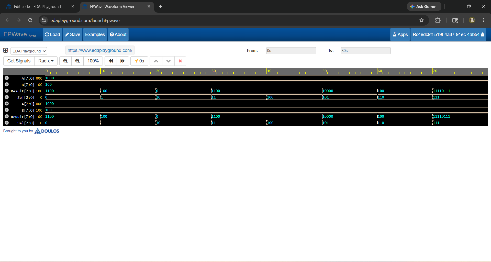

# Design and Verification of an 8-Bit ALU Using Verilog HDL

## Overview

This project implements an 8-Bit Arithmetic Logic Unit (ALU) using Verilog HDL. The ALU performs arithmetic and logical operations based on a 3-bit select signal.

## Features

- Addition
- Subtraction
- Bitwise AND
- Bitwise OR
- Bitwise XOR
- Left Shift
- Right Shift
- Bitwise NOT

## Project Structure

8bit_ALU/
├── alu_8bit.v
├── testbench.v
├── waveform.png
└── README.md

## Operations

| Sel | Operation |
|-----|-----------|
| 000 | Addition |
| 001 | Subtraction |
| 010 | AND |
| 011 | OR |
| 100 | XOR |
| 101 | Left Shift |
| 110 | Right Shift |
| 111 | NOT |

## Tools Used

- Verilog HDL
- VS Code
- EDA Playground
- EPWave Waveform Viewer

## Results

The ALU was successfully simulated and verified. All arithmetic and logical operations produced the expected results.

## Waveform

## Author

Meghana Peddinti
B.Tech - Electronics and Communication Engineering